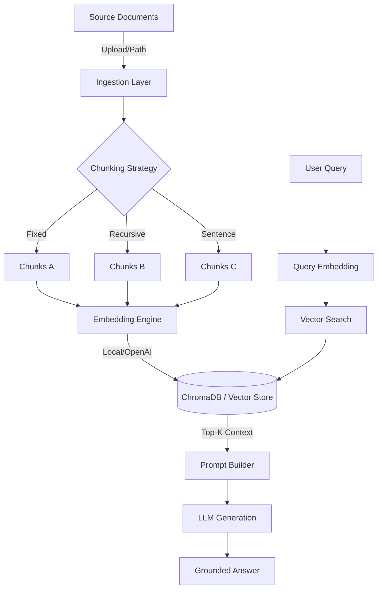

# ⚡ Day 7 - RAG Studio: Advanced Benchmarking Playground

**Tên học viên**: Nguyễn Đôn Đức
**Mã học viên**: 2A202600145
**Lớp**: E403

Chi tiết về Báo cáo tại [REPORT.md](report/REPORT.md)

RAG Studio là một nền tảng thử nghiệm và đánh giá hệ thống **Retrieval-Augmented Generation (RAG)** chuyên sâu. Công cụ này cho phép bạn tải lên tài liệu, tùy chỉnh các tham số cắt nhỏ văn bản (chunking) và so sánh trực quan hiệu quả của các cấu hình khác nhau trong thời gian thực.

---

## 🚀 Tính năng nổi bật

-   **Hỗ trợ đa định dạng**: Nạp dữ liệu từ `.pdf`, `.docx`, `.txt`, `.md`.
-   **Đa chiến lược Chunking**:
    *   `Fixed Size`: Cắt theo kích thước cố định với overlap.
    *   `Recursive`: Cắt phân cấp thông minh (ưu tiên bảo toàn ngữ nghĩa đoạn văn).
    *   `By Sentences`: Cắt dựa trên ranh giới câu.
-   **So sánh song song (Compare Mode)**: Chạy hai cấu hình RAG khác nhau cùng lúc để đánh giá mức độ chính xác của kết quả truy xuất.
-   **Bộ máy Embedding linh hoạt**: Lựa chọn giữa `Local` (CPU-optimized) hoặc `OpenAI` (High accuracy).
-   **Lưu trữ bền vững**: Tích hợp **ChromaDB** để quản lý vector database.

---

## 🛠️ Kiến trúc RAG Pipeline

Dưới đây là sơ đồ luồng hoạt động của hệ thống:



---

## ⚙️ Cài đặt & Cấu hình

### 1. Yêu cầu hệ thống
-   Python 3.10+
-   OpenAI API Key (Nếu sử dụng Real LLM hoặc OpenAI Embedding)

### 2. Cài đặt môi trường
Tạo môi trường ảo và cài đặt các phụ thuộc:

```bash
python -m venv venv
source venv/bin/activate  # Trên Windows: venv\Scripts\activate
pip install -r requirements.txt
```

### 3. Cấu hình biến môi trường
Tạo file `.env` từ mẫu có sẵn:

```bash
cp .env.example .env
```

Cập nhật các thông số quan trọng trong `.env`:
```ini
OPENAI_API_KEY=your_api_key_here
EMBEDDING_PROVIDER=local  # hoặc 'openai'
OPENAI_CHAT_MODEL=gpt-4o-mini
```

---

## 🖥️ Hướng dẫn sử dụng

1.  **Khởi tạo App**:
    ```bash
    streamlit run streamlit_app.py
    ```
2.  **Ingestion**: Tại sidebar, chọn các tham số chunking. Tải lên file trong phần "Document Ingestion" và nhấn **Build Index**.
3.  **Chat**: Sau khi index hoàn tất, bạn có thể đặt câu hỏi ở khung chat.
4.  **Compare**: Bật "Compare Mode" để so sánh hai cấu hình chunking khác nhau (ví dụ: so sánh giữa `fixed_size` 200 và 1000).

---

## 📂 Cấu trúc thư mục

-   `src/chunking.py`: Chứa logic của các thuật toán cắt văn bản.
-   `src/embeddings.py`: Tích hợp các mô hình nhúng (Local & OpenAI).
-   `src/store.py`: Quản lý kết nối và truy vấn Vector Database (ChromaDB).
-   `src/ingestion.py`: Pipeline xử lý file đầu vào.
-   `src/agent.py`: Logic điều phối RAG (Retrieve -> Prompt -> Generate).
-   `streamlit_app.py`: Giao diện người dùng.

---

## ⚠️ Lưu ý
-   Hệ thống mặc định sử dụng `all-MiniLM-L6-v2` cho local embedding để đảm bảo tốc độ trên CPU.
-   Nếu không có API Key, bạn có thể chạy ở **Demo Mode** để kiểm tra luồng logic mà không tốn phí LLM.
