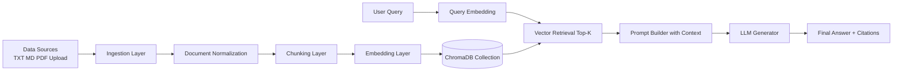
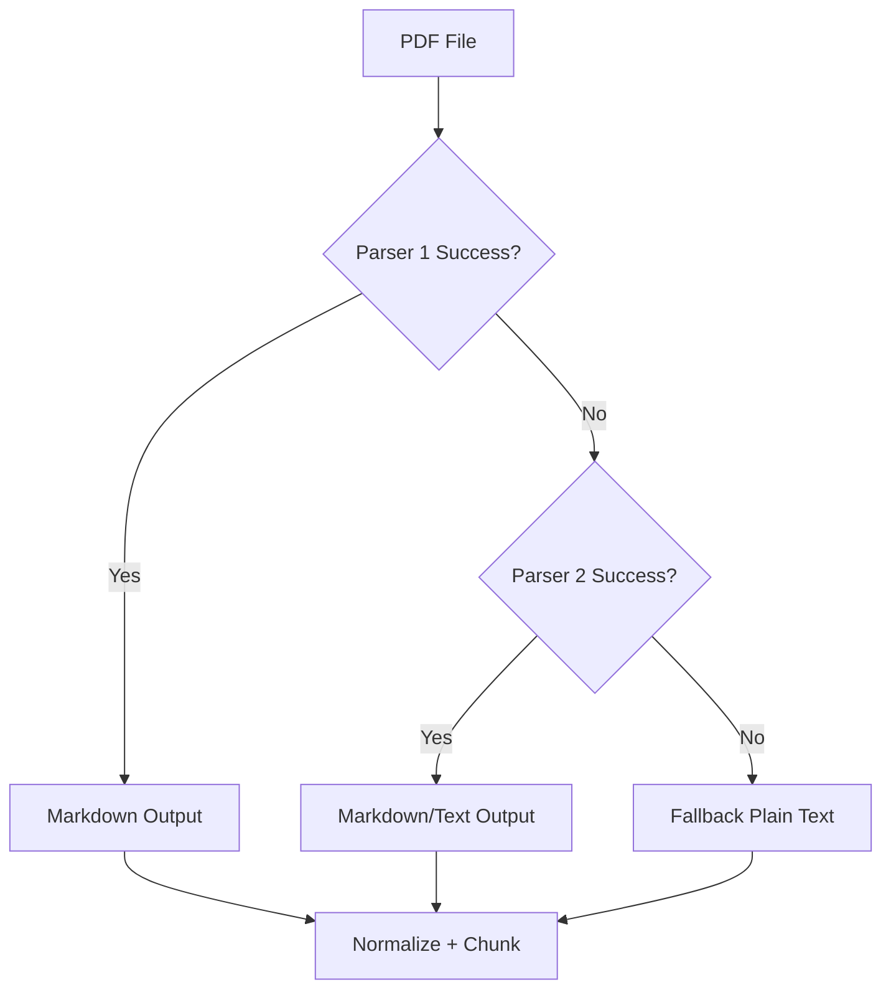
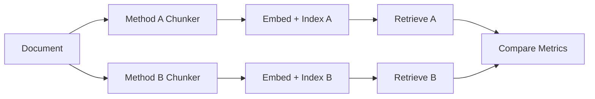

# End-to-End RAG Pipeline Plan

## 1. Muc Tieu

Tai lieu nay dinh nghia ke hoach xay dung pipeline RAG day du, tu ingest du lieu den truy van va tra loi:

- Nhap du lieu tu nhieu nguon (txt/md/pdf).
- Tien xu ly va chunking co the cau hinh.
- Tao embeddings va luu vao ChromaDB.
- Retrieve top-k chunks va sinh cau tra loi co grounding.
- Theo doi truy vet du lieu da su dung de giai thich ket qua.

## 2. Pham Vi

Bao gom:

- Ingestion pipeline (batch va upload runtime).
- Chuong trinh indexer (offline/online).
- Query serving pipeline (retrieval + prompt assembly + LLM generation).
- Logging va evaluation hooks co ban.

Khong bao gom trong phien ban dau:

- Multi-tenant authorization.
- Distributed workers.
- Full production observability stack (OpenTelemetry, Grafana) o muc enterprise.

## 3. Kien Truc Tong Quan



## 4. Ingestion End-to-End

### 4.1 Input Channels

- Folder local (`data/*.txt`, `data/*.md`, `data/*.pdf`).
- Upload tu UI HTML (`multipart/form-data`).
- Future: URL crawler/API connector.

### 4.2 Normalize Document Schema

Moi tai lieu sau ingest duoc chuan hoa theo schema:

- `document_id`: id on dinh.
- `source_uri`: duong dan hoac ten file upload.
- `content_raw`: noi dung goc.
- `content_clean`: noi dung da lam sach.
- `metadata`: map thong tin bo sung.
- `ingested_at`: timestamp.
- `checksum`: hash de phat hien duplicate.

### 4.3 Data Cleaning

- Chuan hoa Unicode (NFC).
- Loai bo null bytes, ky tu control.
- Gom dong trong du thua.
- Giu lai heading/list co nghia de phuc vu chunking.

## 5. Xu Ly PDF

### 5.1 Muc Tieu PDF Extraction

- Uu tien layout-aware extraction (giu section, heading, table text).
- Co fallback extraction khi parser loi.

### 5.2 Strategy De Xuat

Pipeline parser theo thu tu:

1. `marker-pdf` (chat luong cao, giu cau truc markdown).
2. `pymupdf4llm` (nhanh, de fallback).
3. Plain text extraction fallback.



### 5.3 Metadata Rieng Cho PDF

- `page_count`
- `parser_used`
- `extraction_quality` (high/medium/low)
- `page_spans` cho tung chunk neu co

## 6. Chunking Strategy Plan

### 6.1 Built-in Methods

- `fixed_size`: on dinh, de predict chunk count.
- `by_sentences`: tu nhien hon cho QA.
- `recursive`: can bang giua context va do dai chunk.

### 6.2 Chunk Metadata Bat Buoc

Moi chunk can co:

- `doc_id` (document goc)
- `chunk_id` (unique)
- `chunk_index`
- `chunk_method`
- `source_uri`
- `language` (neu detect duoc)

### 6.3 Chunking Experiments

Chay benchmark cung 1 tap query cho 2-3 methods:

- So sanh Precision@k.
- So sanh chunk coherence.
- So sanh token usage trong prompt.



## 7. Embedding + Chroma Storage

### 7.1 Embedding Layer

Lop abstraction:

- `embedding_provider=mock | local | openai`
- Muc tieu: doi provider khong doi business logic.

### 7.2 Chroma Design

- Collection naming: `rag_{domain}_{method}_{version}`
- IDs: `doc_id::chunk_{index}`
- Fields:
  - `documents`: chunk text
  - `embeddings`: vector
  - `metadatas`: json metadata

### 7.3 Indexing Modes

- Full rebuild: xoa collection, index lai toan bo.
- Incremental upsert: chi them/chinh nhung doc thay doi theo checksum.

## 8. Query-Time RAG Flow

### 8.1 Steps

1. Nhap query.
2. Embed query.
3. Retrieve top-k chunks (co/khong metadata filter).
4. Re-rank optional (future).
5. Build prompt voi context va citation markers.
6. Goi LLM.
7. Tra ve answer + danh sach source chunks.

### 8.2 Prompt Design

- System instruction ro rang: "chi dung context cung cap".
- Context format:
  - `[1] chunk text ...`
  - `[2] chunk text ...`
- Buoc output:
  - Answer nganh gon.
  - Co citation `[1] [2]`.

## 9. UI/UX Plan (HTML App)

UI gom 3 khoi:

- `Build Indexes`: upload data, chon Method A/B, params.
- `Run Query`: nhap cau hoi, top_k.
- `Compare Results`: retrieval A/B, score, source, prompt preview, answer.

Can hien thi ro:

- Dang truy xuat tai lieu nao (`source_uri`, `doc_id`, `chunk_index`).
- Tong so docs/chunks da index.
- Khac biet retrieval giua 2 chunking methods.

## 10. Evaluation Plan

### 10.1 Offline Metrics

- Precision@3
- Recall@k (neu co gold chunks)
- MRR (Mean Reciprocal Rank)
- Grounding score (manual)

### 10.2 Human Review Checklist

- Answer co dung context retrieve khong?
- Co hallucination khong?
- Sources hien thi co dung tai lieu goc khong?

## 11. Logging and Traceability

Moi request luu:

- `request_id`
- query text
- top_k
- retrieved chunk ids + scores
- final prompt hash
- answer
- latency tong va latency tung stage

## 12. Ke Hoach Trien Khai Theo Giai Doan

### Phase 1: Foundation (1-2 ngay)

- Chot schema document/chunk metadata.
- Hoan thien ingestion txt/md.
- Tich hop chunking + embedding + in-memory store.

### Phase 2: Chroma + PDF (2-3 ngay)

- Them parser PDF + fallback.
- Ghi chunks vao Chroma.
- Ho tro re-index full/incremental.

### Phase 3: Query Service + UI (2 ngay)

- Hoan thien HTML app compare A/B.
- Hien thi trace retrieval va sources.
- Prompt/answer preview.

### Phase 4: Evaluation + Hardening (2 ngay)

- Benchmark 5-20 queries dai dien.
- Chinh chunking params theo metric.
- Bo sung regression tests cho ingestion/query.

## 13. Risk and Mitigation

- PDF extraction quality khong on dinh:
  - Dung parser fallback + gắn `extraction_quality`.
- Chunk size khong phu hop domain:
  - Chay A/B benchmark thuong xuyen.
- Chi phi embedding/LLM:
  - Cache embeddings theo checksum.
- Hallucination:
  - Prompt grounding + bat buoc citation.

## 14. Definition of Done

Hoan thanh khi dat dong thoi:

- Co pipeline ingest txt/md/pdf den index Chroma.
- UI cho phep upload va compare 2 chunking methods.
- Query tra ve answer + danh sach source chunks.
- Co tai lieu benchmark va bao cao metric.
- Test suite hien tai van pass, khong regression.

## 15. Current Implementation Status

Trang thai hien tai trong repo:

- `TXT/MD ingestion`: da co.
- `PDF ingestion`: da co theo optional parser fallback.
- `Chunking`: da co `fixed_size`, `by_sentences`, `recursive`.
- `Compare mode`: da co trong HTML app.
- `Single mode`: da co trong HTML app.
- `Real LLM`: da co qua OpenAI neu `OPENAI_API_KEY` hop le.
- `Build fresh`: da clear collections truoc khi index lai.
- `Ingest more`: da append file moi theo checksum, khong reset index.

## 16. Runbook

### 16.1 Cai dat toi thieu

```bash
pip install -r requirements.txt
pip install flask
```

Neu muon bat Chroma va PDF:

```bash
pip install chromadb pypdf
```

Neu muon parser PDF tot hon:

```bash
pip install pymupdf4llm
```

Neu muon goi LLM that:

```bash
pip install openai
```

### 16.2 Bien moi truong

Trong `.env`:

```env
OPENAI_API_KEY=your_key_here
OPENAI_CHAT_MODEL=gpt-4o-mini
```

### 16.3 Chay test

```bash
pytest tests/ -v
```

### 16.4 Chay HTML app

```bash
python app_rag_viz.py
```

Sau do mo:

```text
http://127.0.0.1:8501
```

### 16.5 Quy trinh dung app

1. Chon `Single` neu ban muon mot pipeline chunking.
2. Chon `Compare` neu ban muon benchmark 2 chunking strategies song song.
3. Bat `Load bundled sample knowledge base` neu muon dung data co san.
4. Upload file `.txt`, `.md`, hoac `.pdf`.
5. Bam `Build fresh`:
   - App clear Chroma collections cua giao dien.
   - App index lai tu dau.
6. Muon them file moi sau do:
   - Upload file moi.
   - Bam `Ingest more`.
   - App chi them file co checksum moi, khong xoa index cu.
7. Nhap query.
8. Chon `demo` hoac `real (OpenAI)`.
9. Bam `Run query`.

### 16.6 Giai thich tung step trong app

- `Build fresh`: reset app state va clear collection de tranh du lieu cu lam nhieu retrieval.
- `Ingest more`: phu hop khi muon update knowledge base ma khong rebuild.
- `Retrieve`: lay top-k chunks tu index A, va them index B neu compare mode bat.
- `Prompt assembly`: ghep chunks retrieve thanh context.
- `Generate`: gui prompt sang demo LLM hoac OpenAI Responses API.

### 16.7 Luu y van hanh

- Neu chua cai `chromadb`, app van fallback ve in-memory store.
- Neu chua cai parser PDF, app van chay nhung khong ingest duoc `.pdf`.
- Neu khong co `OPENAI_API_KEY`, app van tra demo answer.
